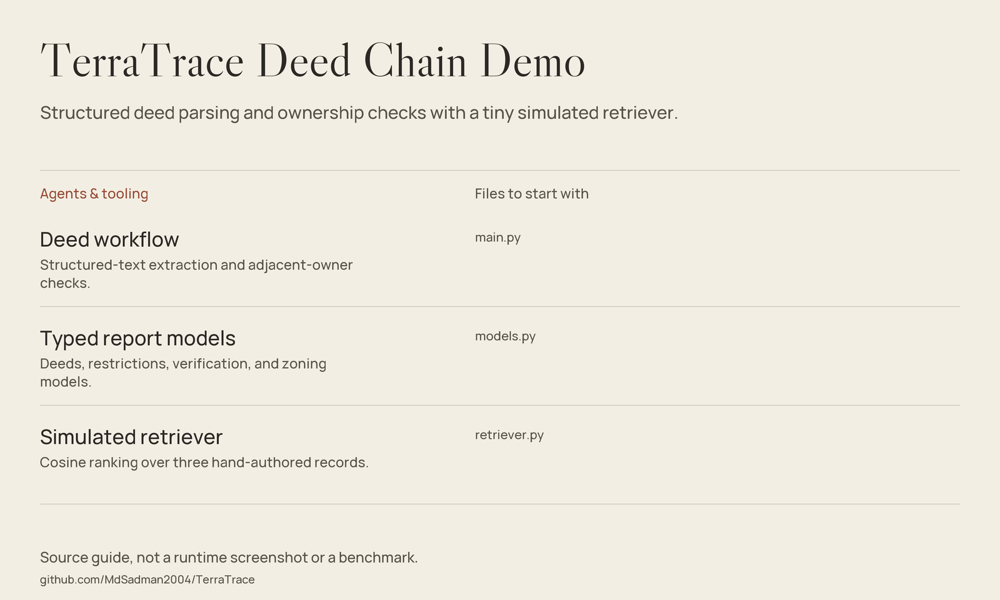

# TerraTrace — Deed Chain & Retrieval Demo



*Source guide drawn from the files in this repository; not a runtime screenshot or a fresh benchmark.*

**A LangGraph teaching prototype for inspecting a small, structured deed history.**
TerraTrace cleans text, extracts labeled transfer fields, checks adjacent
owner names, and emits covenant flags through Pydantic report models.
A tiny in-memory retriever demonstrates cosine ranking with hand-authored vectors.
It does not search an actual county registry or validate a property's title.

> **Not legal or real-estate advice.** Do not rely on the output for ownership,
> conveyancing, liens, easements, zoning permission, or purchase decisions.
> Professional title research and authoritative records remain necessary.

## Implemented features

| Area | Source-backed behavior |
|---|---|
| Text cleaning | Strip whitespace and remove empty lines from already available text. |
| Labeled extraction | Look for `RECORD ENTRY`, `Grantor`, `Grantee`, and `Price` fields. |
| Chain checks | Compare each grantee with the next grantor in input order. |
| Covenant flags | Look for easement, height, and commercial-activity phrases. |
| Typed report | Structure history, restrictions, verification, and zoning via Pydantic. |
| Mock retrieval | Rank three synthetic precedent entries by cosine similarity. |

The “OCR” node is a text cleaner, not an image-to-text engine.
The “semantic” retrieval example uses fixed three-element vectors selected
by keyword rules, not embeddings produced by a model.

## Getting started

Use a Python environment compatible with
[requirements.txt](requirements.txt). Python 3.10+ is a reasonable starting
point; no repository Python version or lockfile is supplied.

```bash
git clone https://github.com/MdSadman2004/TerraTrace.git
cd TerraTrace
python -m venv .venv
```

Activate the environment (`source .venv/bin/activate` on POSIX;
`.venv\Scripts\Activate.ps1` in Windows PowerShell), then:

```bash
python -m pip install -r requirements.txt
python main.py
```

The entry point reads `sample_deeds.txt` beside the script and prints a
summary of the graph's final state. There is no file-input CLI option,
web dashboard, or report-file export in the current entry point.

The manifest lists LangGraph, LangChain Core, ChromaDB, python-dotenv, and
Pydantic. The code uses LangGraph and Pydantic; it does not initialize
ChromaDB, load `.env`, or call OpenAI/Cerebras. No API key is required
by the implemented sample flow.

## Read the example carefully

- The sample is already textual and preformatted; scanned PDFs are unsupported.
- Transfer checks use exact string equality, not entity resolution.
- The retriever corpus is fictional demonstration text, not authoritative precedent.
- The final report is a Pydantic object assembled in memory; terminal printing
  does not mean a legally complete ownership record has been produced.

## Source guide

| File | Purpose |
|---|---|
| [Graph and entry point](main.py) | Cleaning, field extraction, chain checks, covenant flags, and terminal output. |
| [Report models](models.py) | Pydantic deed, restriction, verification, zoning, and report types. |
| [Mock retriever](retriever.py) | Three synthetic records, hand-authored vectors, and cosine ranking. |
| [Sample deeds](sample_deeds.txt) | Two formatted transfer entries and example restrictions. |
| [Dependency declarations](requirements.txt) | Lower bounds, including packages not used by the sample code. |

## Scope & limitations

- No OCR engine, scanned-document parser, county database connector, or
  persistent vector store is implemented.
- The parser emits a deed immediately after finding grantor and grantee.
  In the bundled sample the later price is therefore not attached to that deed.
- Transfers are not sorted by date, names are not normalized, and an empty
  history can be marked complete because no discrepancies were found.
- Restriction years are fixed to `1984`; any height match becomes `30.0` feet.
  Mentioning “commercial activities” can trigger a ban even without a prohibition.
- These heuristics do not evaluate actual zoning rules, liens, encumbrances,
  boundary validity, missing deeds, or rights recorded elsewhere.
- The graph's historical/semantic labels describe the demo's intent, not
  demonstrated legal accuracy or a deployed RAG system.
- No tests or live title search were run for this documentation refresh.

## License

No license file is present in this repository. This README does not grant a license.
