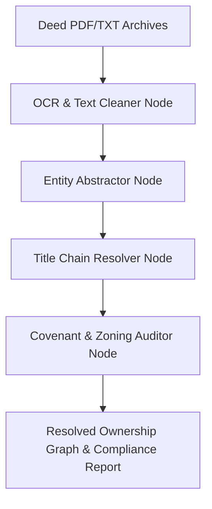

# TerraTrace Agent 🗺️ — Land Title & Deed Chain Resolver

TerraTrace is an automated real estate title search and deed history analyzer. Built with a stateful **LangGraph** workflow and local **ChromaDB** vector storage, it processes scanned historical land deeds, abstracts restrictive covenants, and resolves ownership chains chronologically.

## System Architecture



1.  **OCR & Text Cleaner Node**: Cleans scanning noise and structures raw textual inputs.
2.  **Entity Abstractor Node**: Identifies Grantor (Seller), Grantee (Buyer), Date of sale, Transaction price, and Legal boundary descriptions.
3.  **Title Chain Resolver Node**: Maps the sequence of transactions chronologically to verify that there are no ownership gaps or unauthorized title breaks.
4.  **Covenant Auditor Node**: Flags easements (e.g. utility access), zoning restrictions, or construction height limitations.

## Getting Started

### 1. Installation
Clone the repository and install required modules:
```bash
pip install -r requirements.txt
```

### 2. Configure Environment
Set up your local LLM or API keys in a `.env` file (if using cloud embeddings or Cerebras/OpenAI models):
```ini
OPENAI_API_KEY=your_key_here
# OR
CEREBRAS_API_KEY=your_key_here
```

### 3. Run Pipeline
Execute the pipeline against local sample deeds:
```bash
python main.py
```
This runs the local script, displaying the step-by-step state log of the LangGraph chain and outputs the resolved ownership transition history in a clean format.
